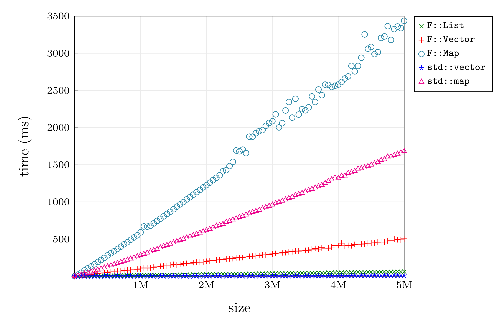
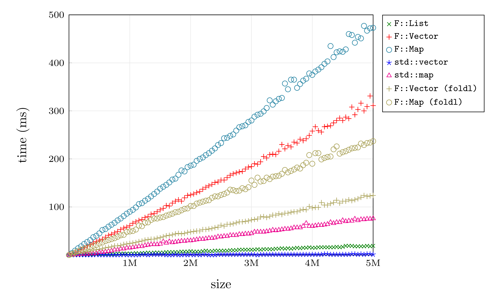

LIBF++ 0.2 -- C++ as a Pure Functional Language
===============================================

LibF is a library that supports pure functional programming in C++.

Modern C++ purports to be a "multi-paradigm" programming language supporting
procedural, object-oriented and functional features.  In reality however, most
C++ code continues to be written in the classic object-oriented/procedural
style.  This is especially true for the C++ standard library, where common
standard data structures (`map`, `set`, `vector`, `string`, etc.) are
*mutable* (stateful) objects unsuitable for pure functional programming.
For example:

```C++
    std::vector<int> xs;
    for (int i = 0; i < 10; i++)
        xs.push_back(i);
```

In each iteration of the loop the `xs` object is destructively mutated.

To support pure functional programming, LibF supplies *immutable* (persistent)
replacements to common C++ standard library objects.  For example, using LibF
the above code can be translated into:

```C++
    F::Vector<int> xs;
    for (int i = 0; i < 10; i++)
        xs = F::push_back(xs, i);
```

Since LibF objects are *immutable*, the following code possible:

```C++
    F::Vector<int> xs;
    for (int i = 0; i < 5; i++)
        xs = F::push_back(xs, i);
    F::Vector<int> ys = xs;  // Save the current xs
    for (int i = 0; i < 5; i++)
        xs = F::push_back(xs, i);
    printf("%s\n%s\n", c_str(show(ys)), c_str(show(xs)));
```

This code will print:

    <0,1,2,3,4>
    <0,1,2,3,4,0,1,2,3,4>

The old object `ys` was unaffected by the changes made to the copy `xs`.
Furthermore, the LibF vector `push_back` operation is still O(1) -- although
the constant factors may differ (see below).

With immutable objects, it is possible to use (a subset of) C++ as a pure
functional programming language.  Compared to other functional languages, C++
has several advantages, namely:

* *Compiler Support*.  C++ is supported by several stable, mature optimizing
  compilers.
* *Compatibility*.  One major problem with many functional programming
  languages (and non-C/C++ languages in general) is that external software
  components (libraries) generally support a C/C++ interface only.  But by
  using C++ as a functional language, these libraries can be used
  directly without any special language binding.
* *Impurity*.  Pure and impure code can be mixed.  This also means that impure
  operations such as I/O can be used as normal.
* *You want functional programming, your boss wants C++* -- why not have both?

Features:
---------

LibF currently provides the following basic data types:

* Lists.
* Maps.
* Sets.
* Strings.
* Tuples.
* Vectors.
* Maybes.

Each of these is immutable, and supports operations with a runtime complexity
as similar as reasonably possible to that of the stdlib++ counterpart.

In addition to be above, LibF supports the following features:

* *Automatic memory management*:  Currently LibF uses the Boehm GC.
  In future a version using reference counting may be possible.
* *Discriminated union types*: supported via `F::Union`.
* *Strict*: C and C++ are strict (not lazy) languages, so LibF is also strict.
* *No stdlib++ dependency*.  LibF does not depend on the C++ standard library.
  Both libraries can still be used together if desired.
* *Pass-by-copy semantics*:  Most standard LibF data structures are small
  (i.e. `sizeof(void *)`) and can be passed-by-copy with no additional
  overhead.  Pass-by-pointer and Pass-by-reference can be largely avoided.

LibF assumes C++17.  This can be enabled by passing the `-std=c++1z` option to
`clang++-4.0`.

Quick Programming Guide:
------------------------

### Functions and Closures

For pure functional programming in C++ we use standard C-style functions in
place of C++-style objects and methods.  By default functions are considered
*impure*, meaning that they may have side-effects (e.g. modify memory, perform
I/O operations, etc.).  To declare a function as *pure* (side-effect free),
use the "PURE" keyword in the function declaration:

```C++
    PURE int f(int x, int y, int z);
```

*NOTE*: I had wanted to use "pure" (lowercase) but the C++ preprocessor does
not like this.

If the "PURE" keyword is used, then the compiler may apply additional
optimizations, e.g. common sub-expression elimination to remove multiple
redundant function calls.

C++ since 2011 supports a lambda syntax.  This can be used to create anonymous
functions as follows:

```C++
    auto f = [] (int x) -> int { return x+1 };
```

The LibF library contains the set usual FP operations over lists, maps, etc.
For example:

```C++
    // Capitalize a string via a list:
    F::List<char32_t> xs = F::list(F::string("Hello World!"));
    xs = F::map<char32_t>(toupper, xs);
    printf("%s\n", F::c_str(F::string(xs)));
```

### Data Types

Libf provides several data types that are roughly equivalent to the standard
library counterparts, including lists, maps, sets, strings, vectors, etc.
Generally the LibF equivalent begins with a capital letter rather than
lowercase.

Data types (except for String) are polymorphic using the standard template
syntax, e.g.:

```C++
    F::List<int> xs;
    F::Vector<double> ds;
    F::Map<F::List<char>, F::String> m;
```

Objects of LibF data types are always pointer-sized and can safely be
passed-by-copy without any performance impact.

Most standard library data types can be directly substituted for LibF
equivalents.  However, there may be some exceptions.  For example, in C++ it
is common to construct vectors using `push_back` using the following idiom:

```C++
    std::vector<int> xs;
    for (int i = 0; i < 10; i++)
        xs.push_back(i);
```

In principle, this can be replaced with:

```C++
    F::Vector<int> xs;
    for (int i = 0; i < 10; i++)
        xs = F::push_back(xs, i);
```

Although each `F::push_back` operation is still O(1), the constant factors
may differ by a factor of 100.  Instead it may be better to use a list, e.g.:

```C++
    F::List<int> xs;
    for (int i = 0; i < 10; i++)
        xs = F::list(i, xs);
```

Or, simply use the mutable version if performance is critical.

That said, compared to `std::vector`, the LibF `F::Vector` is much faster at
appending, splitting, and pushing elements to the front.  So its usefulness
ultimately depends on the application.

### Discriminated Union Types

LibF supports discriminated union types using `F::Union`.  For example, to
create your own list type:

```C++
    template <typename T> struct NODE;
    struct EMPTY;
    template <typename T>
    using LIST = F::Union<EMPTY, NODE<T>>;
    struct EMPTY { };
    struct NODE
    {
        T val;
        LIST<T> next;
    };
    #define LIST_EMPTY      LIST<void>::index<EMPTY>()
    #define LIST_NODE       LIST<void>::index<NODE<void>>()
```

The type `LIST` is defined to be a discriminated union between the `EMPTY` and
`NODE` structs.  As with other LibF objects, a `LIST` object is word-sized so
can be passed-by-copy.  The index of the underlying type for a discriminated
union is returned by a special `F::index` function, which can be used to
determine if a `LIST` object is empty or a node.  The discriminated union type
can be down-cast to the underlying type, or the underlying type can be up-cast
to a `F::Union`.  For example, the following function reverses a `LIST` by
accumulating onto `ys`:

```C++
	template <typename T>
	PURE LIST<T> reverse(LIST<T> xs, LIST<T> ys)
	{
	    switch (F::index(xs))	// Determine if xs is a node or empty.
	    {
	        case LIST_EMPTY:
	            return ys;
	        case LIST_NODE:
	        {
	            NODE<T> &x = xs;
	            const NODE<T> y = {x.val, ys};
	            return reverse(x.next, y);
	        }
	    }
	}
```

The built-in LibF `F::List` and `F::Maybe` types are already implemented as
discriminated unions.

### Iterators

Most LibF data types support iterators that can be used to traverse the
object.

```C++
    F::String s = F::string("Hello World!\n");
    F::List<char32_t> xs;
    for (F::StringItr i = begin(s), ie = end(s); i != ie; ++i)
        xs = F::list(*i, xs);
```

Or a simpler version using range loops:

```C++
    F::String s = F::string("Hello World!\n");
    F::List<char32_t> xs;
    for (auto c: s)
        xs = F::list(c, xs);
```

Strictly speaking iterators are not "pure" since they are stateful, and are
destructively modified via the standard operators such as (`++`).  Technically
it is possible to implement pure iterators, but this is very inefficient.
Libf iterators maintain a copy of the original object being iterated over,
thus it is not possible to "invalidate" an iterator by a subsequent update
(unlike standard library iterators).

Except for lists, iterators for LibF objects are generally more expensive in
both time and space compared to the standard library counterparts.  This is
because iterators over immutable trees must maintain a larger internal state
(essentially a stack from the root to the current internal node).

The interface to LibF iterators is the same as with standard C++, except `begin`
and `end` are functions rather than object methods.  Using the standard
interface allows LibF iterators to be used in C++ range loops.

Library Documentation:
----------------------

* [LibF full documentation](https://www.comp.nus.edu.sg/~gregory/libf/doc/)
    * [List functions](https://www.comp.nus.edu.sg/~gregory/libf/doc/list.html)
    * [Map functions](https://www.comp.nus.edu.sg/~gregory/libf/doc/map.html)
    * [Set functions](https://www.comp.nus.edu.sg/~gregory/libf/doc/set.html)
    * [Vector functions](https://www.comp.nus.edu.sg/~gregory/libf/doc/vector.html)
    * [String functions](https://www.comp.nus.edu.sg/~gregory/libf/doc/string.html)
    * [Tuple functions](https://www.comp.nus.edu.sg/~gregory/libf/doc/tuple.html)
    * [Maybe functions](https://www.comp.nus.edu.sg/~gregory/libf/doc/maybe.html)

Examples:
----------

Some example programs exist in the `examples` directory:

* `LibF2html`: Simple program that converts LibF headers into HTML.
* `test`: Test program.
* `bench`: Simple benchmark program.

Benchmarks:
-----------

The following compares the time building various LibF and stdlib data
structures:

<p align="center">

</p>

Unsurprisingly, constructing a `std::vector` is the fastest.  The fastest for
LibF is constructing a linked-list `F::List`, followed by `F::Vector`.
Constructing `F::Map` has about twice the overhead as the mutable `std::map`
counterpart.  Such results are expected (immutability has inherent costs).
Note that these benchmarks assume that the garbage collector is disabled.
Otherwise garbage collector overheads become a significant factor about the 3M
mark.

The following compares the time to scan each data structure using `foldl` or a
C++ range loop, i.e.:

```C++
    int sum = 0;
    for (auto x: xs) sum += x;
```

<p align="center">

</p>

Note that range loops use iterators, which are slower for LibF data structures
compared to the mutable standard library counterparts.  The `foldl`
alternatives are faster, but are less expressive in general.

Under the Hood:
---------------

* Discriminated unions are implemented as tagged pointers.
* Maps and sets are implemented as balanced 234-trees.
* Vectors and strings are implemented as 23-finger trees.

The library implements polymorphic types using a variant of the ugly
cast-everything-to-void idiom, as opposed to the more standard C++
put-everything-in-the-header-file idiom.  This keeps binary size small.

Issues:
-------

LibF is alpha/beta quality software.  There are likely to be some bugs and/or
missing functions.

If you would like to contribute, please send pull requests here:
https://github.com/GJDuck/libf/pulls

Building:
---------

To build simply run the `build.sh` script.

The only non-standard dependency for LibF is the Boehm garbage collector.  It
can be installed as follows on Linux:

    $ sudo apt-get install libgc-dev

You will also need to install a recent version of the `clang++` compiler.  See
[here](http://apt.llvm.org/) for more information.

Retrospective:
--------------

Ideally, LibF should be written to support reference counting rather than
relying on automatic garbage collection This would make the library more
compatible with many C++ projects where using a GC is out-of-the-question.
Such a change would require most of the contents of the library to be moved
into the header files, which is not ideal, but is also the C++ way of doing
things.

